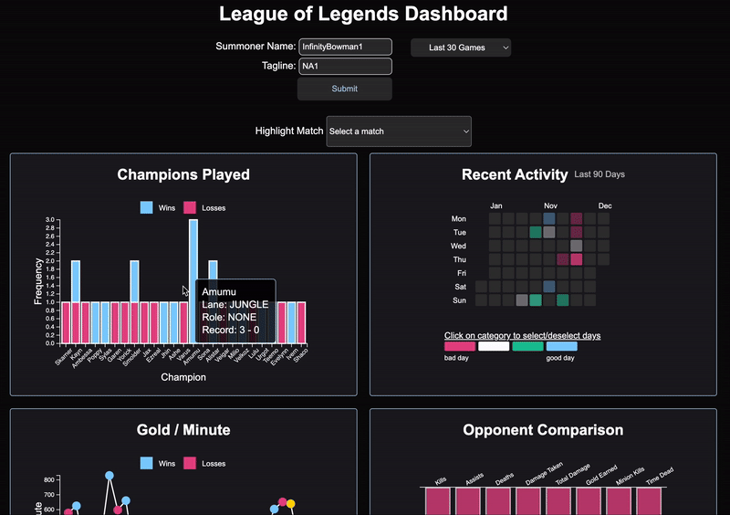

Dashboard for League of Legends match data built using D3.js and NodeJS with Express and Axios to fetch live summoner data from the Riot API.

To run project:

-change directory to riot-api-proxy

-run: "node server.js" in terminal

-pull up http://localhost:3010/ on a web browser

-click submit with autofilled or specified username and tagline
